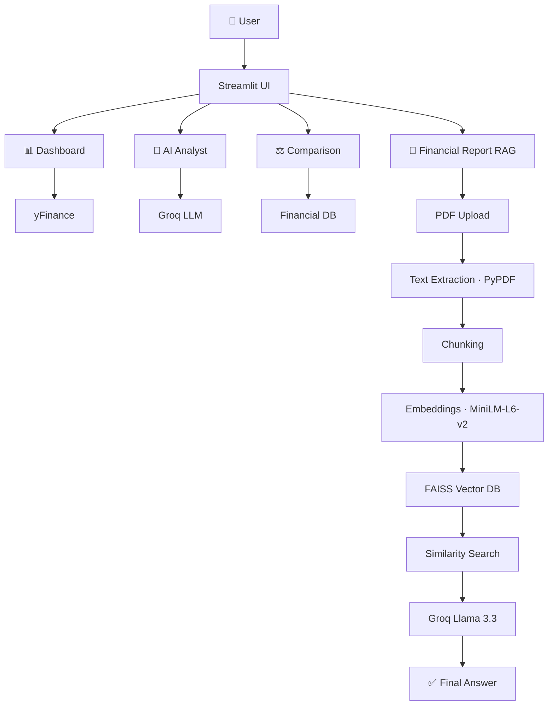

<div align="center">

# 📈 FinQUERY AI

**AI-Powered Financial Intelligence Platform**

*Analyze Companies · Compare Stocks · Generate AI Insights · Query Financial Reports with RAG*

[](https://www.python.org/)
[](https://streamlit.io/)
[](https://groq.com/)

</div>

---

## Live Demo

[](https://finquery-ai.streamlit.app/)


## 📑 Table of Contents

- [Overview](#-overview)
- [Features](#-features)
- [System Architecture](#%EF%B8%8F-system-architecture)
- [RAG Pipeline](#-rag-pipeline)
- [Technology Stack](#%EF%B8%8F-technology-stack)
- [Project Structure](#-project-structure)
- [Installation](#%EF%B8%8F-installation)
- [Environment Variables](#-environment-variables)
- [Run Application](#%EF%B8%8F-run-application)
- [Future Enhancements](#-future-enhancements)
- [Author](#-author)

---

## 🚀 Overview

**FinQUERY AI** is an AI-powered financial intelligence platform that combines:

| | |
|---|---|
| 📊 | **Financial Analytics** |
| 🤖 | **AI Financial Analysis** |
| ⚖️ | **Company Comparison** |
| 📄 | **Retrieval-Augmented Generation (RAG)** |

into a single interactive application.

The platform enables users to analyze publicly traded companies, compare financial performance, generate investment insights, and interact with annual reports using natural language queries.

---

## ✨ Features

### 📊 Financial Dashboard

- Market Capitalization Analysis
- Revenue Analysis
- Net Income Analysis
- Operating Cash Flow Analysis
- Stock Performance Tracking
- Moving Average Analysis
- Interactive Visualizations

### 🤖 AI Financial Analyst

Generate professional financial reports using LLMs, including:

- Company Overview
- Financial Health Analysis
- Profitability Analysis
- Risk Assessment
- Growth Opportunities
- Investment Outlook
- Final Verdict

> Powered by **Groq** running **Llama 3.3 70B**

### ⚖️ Company Comparison

Compare any two publicly traded companies side by side.

```text
AAPL vs MSFT
TSLA vs NVDA
JPM  vs AXP
```

**Metrics compared:**

| Metric | Metric | Metric |
|---|---|---|
| Market Cap | Revenue | Net Income |
| Operating Income | Cash Flow | PE Ratio |
| Dividend Yield | ROE | |

### 📄 Financial Report RAG

Upload annual reports and ask questions in plain English.

```text
"What are the major risks?"
"What was the company's revenue?"
"What are future growth opportunities?"
"Summarize the business model."
```

**Capabilities:**

- 📤 PDF Upload
- 🔍 Semantic Search
- 🧩 Context Retrieval
- 📌 Source-Based Answers
- 💬 Financial Question Answering

---

## 🏗️ System Architecture



---

## 🧠 RAG Pipeline

| Step | Stage | Detail |
|:---:|---|---|
| 1️⃣ | **Upload Financial Report** | `Apple_Annual_Report.pdf` |
| 2️⃣ | **Extract Text** | `PdfReader()` |
| 3️⃣ | **Chunk Text** | Chunk Size = `1000` · Overlap = `200` |
| 4️⃣ | **Generate Embeddings** | `SentenceTransformer("all-MiniLM-L6-v2")` |
| 5️⃣ | **Store Vectors** | `FAISS` |
| 6️⃣ | **User Query** | `"What are Apple's major risks?"` |
| 7️⃣ | **Similarity Search** | Retrieve Top-K relevant chunks |
| 8️⃣ | **LLM Generation** | `Groq` + `Llama 3.3 70B` |
| 9️⃣ | **Grounded Response** | Answer generated using retrieved document context |

---

## 🛠️ Technology Stack

| Category | Technology |
|---|---|
| **Frontend** | Streamlit |
| **LLM** | Groq |
| **Model** | Llama 3.3 70B |
| **Financial Data** | yFinance |
| **Vector Search** | FAISS |
| **Embeddings** | Sentence Transformers |
| **PDF Processing** | PyPDF |
| **Visualization** | Plotly |
| **Data Analysis** | Pandas |
| **Numerical Computing** | NumPy |

---

## 📂 Project Structure

```text
FinQUERY_AI/
│
├── components/
│   ├── dashboard.py
│   ├── analyst.py
│   ├── comparison.py
│   └── rag_chat.py
│
├── services/
│   ├── financial_data.py
│   ├── stock_data.py
│   ├── llm_service.py
│   └── rag_service.py
│
├── utils/
│   ├── helpers.py
│   └── constants.py
│
├── app.py
├── requirements.txt
├── README.md
└── .env.example
```

---

## ⚙️ Installation

**1. Clone the repository**

```bash
git clone https://github.com/yourusername/FinQUERY_AI.git
cd FinQUERY_AI
```

**2. Create a virtual environment**

```bash
python -m venv venv
```

**3. Activate the environment**

```bash
# Windows
venv\Scripts\activate

# Linux / Mac
source venv/bin/activate
```

**4. Install dependencies**

```bash
pip install -r requirements.txt
```

---

## 🔑 Environment Variables

Create a `.env` file in the project root:

```env
GROQ_API_KEY=your_groq_api_key
```

---

## ▶️ Run Application

```bash
streamlit run app.py
```

---

## 🚀 Future Enhancements

- [ ] Multi-PDF RAG
- [ ] Portfolio Analysis
- [ ] Financial News Summarization
- [ ] Earnings Call Analysis
- [ ] Persistent Vector Database
- [ ] Agentic Financial Assistant
- [ ] Multi-Agent Research System

---

## 👨‍💻 Author

**Nikhil Mishra**
*B.E. Computer Science and Engineering*

Interested in:

`Artificial Intelligence` · `Machine Learning` · `Data Science` · `Financial Analytics` · `LLM Engineering`

---
